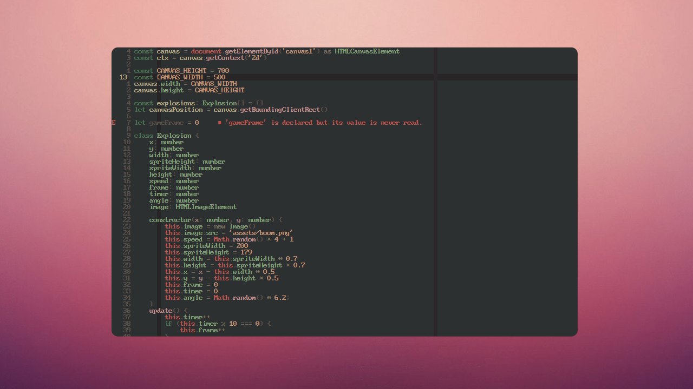
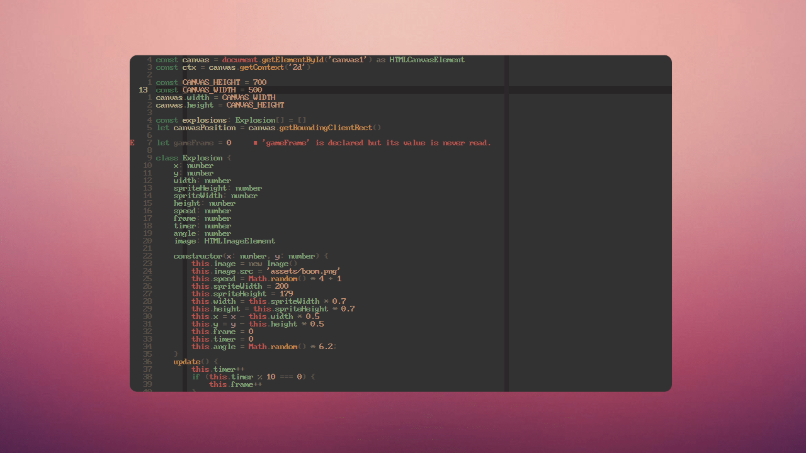
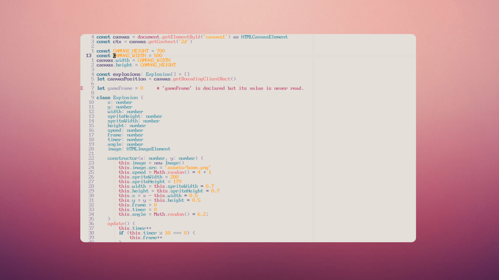

Based on **[rose-pine](https://github.com/rose-pine/neovim)** but warmer, more cozy, relaxing and easier on eyes :)

## Install

**[Paq](https://github.com/savq/paq-nvim)**

```lua
require('paq')({
  { 'mine-pine/neovim', as = 'mine-pine' }
})
```

**[lazy.nvim](https://github.com/folke/lazy.nvim)**

```lua
require("lazy").setup({
  { 'mine-pine/neovim', name = 'mine-pine' }
})
```

**[packer.nvim](https://github.com/wbthomason/packer.nvim)**

```lua
require('packer').startup(function(use)
  use({ 'mine-pine/neovim', as = 'mine-pine' })
end)
```

## Gallery

**Mine Pine**



**Mine Pine Moon**



**Mine Pine Dawn**



## Options

> [!NOTE]
> Options should be set **before** colorscheme

Variant respects `vim.o.background`, using dawn when light and `dark_variant` when dark

```lua
require('mine-pine').setup({
	--- @usage 'auto'|'main'|'moon'|'dawn'
	variant = 'auto',
	--- @usage 'main'|'moon'|'dawn'
	dark_variant = 'main',
	bold_vert_split = false,
	dim_nc_background = false,
	disable_background = false,
	disable_float_background = false,
	disable_italics = false,

	groups = {
		background = 'base',
		background_nc = '_experimental_nc',
		panel = 'surface',
		panel_nc = 'base',
		border = 'highlight_med',
		comment = 'muted',
		link = 'iris',
		punctuation = 'subtle',

		error = 'love',
		hint = 'iris',
		info = 'foam',
		warn = 'gold',

		headings = {
			h1 = 'iris',
			h2 = 'foam',
			h3 = 'rose',
			h4 = 'gold',
			h5 = 'pine',
			h6 = 'foam',
		}
		-- or set all headings at once
		-- headings = 'subtle'
	},

	-- Change specific vim highlight groups
	-- https://github.com/mine-pine/neovim/wiki/Recipes
	highlight_groups = {
		ColorColumn = { bg = 'rose' },

		-- Blend colours against the "base" background
		CursorLine = { bg = 'foam', blend = 10 },
		StatusLine = { fg = 'love', bg = 'love', blend = 10 },

		-- By default each group adds to the existing config.
		-- If you only want to set what is written in this config exactly,
		-- you can set the inherit option:
		Search = { bg = 'gold', inherit = false },
	}
})

-- Set colorscheme after options
vim.cmd('colorscheme mine-pine')
```

- Get highlight groups under cursor via `:Inspect` in Neovim 0.9 or [nvim-treesitter/playground](https://github.com/nvim-treesitter/playground#show-treesitter-and-syntax-highlight-groups-under-the-cursor)
- [Adding new highlight groups](https://github.com/mine-pine/neovim/issues/6#issuecomment-962466323)
